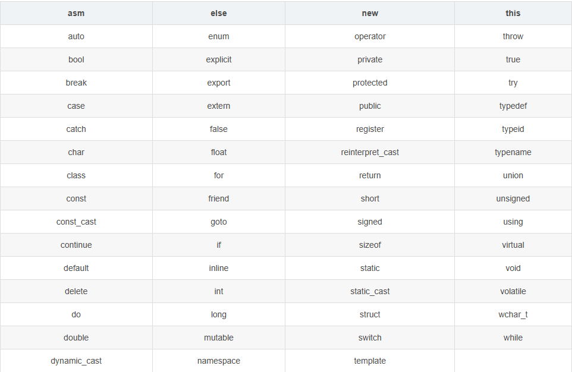
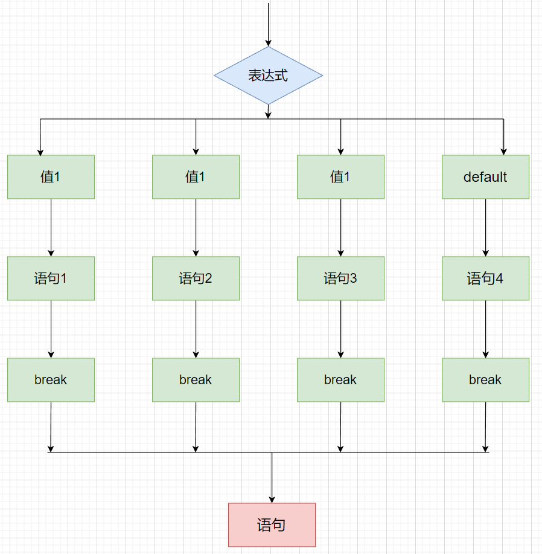

# C++ 基础 (1)

<a id="0">`目录`</a>

- $\textcolor{#e18a3b}{【零】}$[**介绍**](#00)
- $\textcolor{#e18a3b}{【一】}$**[基础语法](#1)**
- $\textcolor{#e18a3b}{【二】}$**[数据类型](#2)**
- $\textcolor{#e18a3b}{【三】}$**[程序流程](#3)**

> <a id="00">介绍</a>
> 
> ​    C++ 是一种静态类型的、编译式的、通用的、大小写敏感的、不规则的编程语言，支持过程化编程、面向对象编程和泛型编程。
> 
> ​    C++既可以进行C语言的过程化程序设计，又可以进行以抽象数据类型为特点的基于对象的程序设计，还可以进行以继承和多态为特点的面向对象的程序设计。C++擅长面向对象程序设计的同时，还可以进行基于过程的程序设计。 C++几乎可以创建任何类型的程序：游戏、设备驱动程序、HPC、云、桌面、嵌入式和移动应用等。 甚至用于其他编程语言的库和编译器也使用C++编写。
> 
> 标准库：
> 
> - 核心语言，提供了所有构件块，包括变量、数据类型和常量，等等。
> - C++ 标准库，提供了大量的函数，用于操作文件、字符串等。
> - 标准模板库（STL），提供了大量的方法，用于操作数据结构等。
> 
> <!--环境设置-->
> 
> [开发工具]()

## 一、基础语法

<a id="1"><!--目录--></a>

- $\textcolor{#2a6e3f}{【1】}$ [注释](#1.1)
- $\textcolor{#2a6e3f}{【2】}$ [关键字](#1.2)
- $\textcolor{#2a6e3f}{【3】}$ [标识符](#1.3)
- $\textcolor{#2a6e3f}{【4】}$ [简单示例](#1.4)

### 1、注释<a id="1.1">💚</a>

```c++
//单行注释

/*
多行注释
多行注释
*/
```

<!--注释：程序的注释是解释性语句，您可以在 C++ 代码中包含注释，这将提高源代码的可读性。所有的编程语都允许某种形式的注释。C++ 支持单行注释和多行注释。注释中的所有字符会被 C++ 编译器忽略。-->

### 2、关键字<a id="1.2">💚</a>



### 3、标识符<a id="1.3">💚</a>

- **标识符是用来标识变量、函数、类、模块，或任何其他用户自定义项目的名称**。一个标识符以字母 A-Z 或 a-z 或下划线 _ 开始，后跟零个或多个字母、下划线和数字（0-9）。
- 标识符内不允许出现标点字符，比如 @、& 和 %。**==C++ 是区分大小写的编程语言==**。

### 4、简单示例<a id="1.4">💚</a>

```c++
#include <iostream>
using namespace std;
 
// main() 是程序开始执行的地方
int main()
{
   cout << "Hello World" << endl; // 输出 Hello World
   return 0;
}
```

[<!--返回目录-->](#1)

## 二、数据类型

<a id="2"><!--目录--></a>

- $\textcolor{#2a6e3f}{【1】}$ [基本数据类型](#2.1)
- $\textcolor{#2a6e3f}{【2】}$ [基本数据](#2.2)
- $\textcolor{#2a6e3f}{【3】}$ [sizeof](#2.3)
- $\textcolor{#2a6e3f}{【4】}$ [typedef](#2.4)
- $\textcolor{#2a6e3f}{【5】}$ [变量](#2.5)
- $\textcolor{#2a6e3f}{【6】}$ [存储类](#2.6)
- $\textcolor{#2a6e3f}{【7】}$ [运算符](#2.7)

### 1、基本数据类型<a id="2.1">💛</a>

|     类型     | 关键字 |
| :----------: | :----: |
|    布尔型    |  bool  |
|    字符型    |  char  |
|     整型     |  int   |
|    浮点型    | float  |
| 双精度浮点型 | double |
|    无类型    |  void  |

**类型修饰符**：

- `signed`
- `unsigned（无符号）`
- `short`
- `long`

> 修饰符 **signed、unsigned、long 和 short** 可应用于整型，**signed** 和 **unsigned** 可应用于字符型，**long** 可应用于双精度型。
>
> 修饰符 **signed** 和 **unsigned** 也可以作为 **long** 或 **short** 修饰符的前缀。例如：**unsigned long int**。
>
> C++ 允许使用速记符号来声明**无符号短整数**或**无符号长整数**。您可以不写 int，只写单词 **unsigned、short** 或 **long**，**int** 是隐含的。例如，下面的两个语句都声明了无符号整型变量。

注：<!--一些基本类型可以使用一个或多个类型修饰符进行修饰，比如：signed short int简写为short、signed long int 简写为long。-->

###### ASCll码表格


---

### 2、基本数据<a id="2.2">💛</a>

#### 2.1、char

单个字符（使用单引号引用）（只能放单个字符）

==**不可用双引号**==

`举例`

```c++
char a = 'a';
cout << a << "\t" << sizeof(a) << endl; // a    1
cout << (int)a << endl;                 // 97
```

#### 2.2、字符串型

###### 1、

```c++
char c_char[]="hello world\0";//双引号 (数组形式)
printf("%s\n",c_char);
```

###### 2、

```c++
const char* c_char="hello world\0";//双引号 (数组形式)
std::cout << *c_char << std::endl;
```

###### 3、

`string 变量名 = "......"`

```c++
string a="hello world!";
cout<<a<<endl;
```

---

### 3、sizeof<a id="2.3">💛</a>

> ***可以获取各数据类型在内存中所占的字节数***

`举例`

```cpp
cout << sizeof(int) << endl;    // 4
cout << sizeof(char) << endl;   // 1
cout << sizeof(bool) << endl;   // 1
cout << sizeof(long) << endl;   // 8
cout << sizeof(float) << endl;  // 4
cout << sizeof(double) << endl; // 8
```

`注意`

- <mark>**指针变量的大小与指向对象无关，和计算机内部地址总线相关。**</mark>

```cpp
int a = 10;
int *p = &a;
cout << sizeof(p) << endl; // 8
long b = 10;
long *p_l = &b;
cout << sizeof(p_l) << endl; // 8
```

- <mark>**不同的机器、操作系统、编译器的数据长度不同**</mark>

`其他基本数据类型所占内存空间`


---

### 4、typedef<a id="2.4">💛</a>

**<mark>*typedef*</mark>为一个已有的类型取一个新的名字**

`格式`

typedef + [type] +[new_name]

`举例`

```cpp
typedef int new_int;
new_int a = 20;
cout << sizeof(new_int) << endl; // 4
```

---

### 5、变量<a id="2.5">💛</a>

#### 5.1、变量

​	变量其实只不过是程序可操作的存储区的名称。C++ 中每个变量都有指定的类型，类型决定了变量存储的大小和布局，该范围内的值都可以存储在内存中，运算符可应用于变量上。

`格式`

```
[type] <typeName>
```

#### 5.2、变量作用域

- <mark>局部变量</mark>：在**函数或一个代码块内部声明**的变量，它们**只能被函数内部或者代码块内部**的语句使用

- <mark>形参变量</mark>：在**函数参数的定义**中声明的变量。

- <mark>全局变量</mark>：在所有函数外部声明的变量。全局变量的值在程序的整个生命周期内都是有效的。

  全局变量可以被任何函数访问。也就是说，全局变量一旦声明，在整个程序中都是可用的。

- <mark>**当局部变量被定义时，系统不会对其初始化，您必须自行对其初始化。定义全局变量时，系统会自动初始化值**</mark>

`转义字符`

| 转移字符                 | 含义 |
| ------------------------ | ---- |
| 换行                     | \n   |
| 反斜杠                   | \\\  |
| 水平制表符(整齐输出数据) | \t   |
| 警示音                   | \a   |
| 回车                     | \r   |

---

### 6、存储类<a id="2.6">💛</a>

存储类定义 C++ 程序中变量/函数的范围**（可见性）和生命周期**。这些说明符放置在它们所修饰的类型之前。

| auto | register | static | extern | mutable | thread_local |
| :--: | :------: | :----: | :----: | :-----: | :----------: |

`注意`

- **从 C++ 17** 开始，**auto** 关键字不再是 C++ 存储类说明符，且 **register** 关键字被弃用。
- **thread_local** 是C++11支持

#### 5.1、auto

​	自 C++ 11 以来，**auto** 关键字用于两种情况：声明变量时根据初始化表达式自动推断该变量的类型、声明函数时函数返回值的占位符。

```cpp
auto f=3.14;      //double
auto s("hello");  //const char*
auto z = new auto(9); // int*
auto x1 = 5, x2 = 5.0, x3='r';//错误，必须是初始化为同一类型


auto a = 10;
cout << sizeof(a) << endl;        // 4
cout << typeid(a).name() << endl; // i
```

#### 5.2、register

​	**register** 存储类用于定义存储在寄存器中而不是 RAM 中的局部变量。这意味着变量的最大尺寸等于寄存器的大小（通常是一个词），且不能对它应用一元的 '&' 运算符（因为它没有内存位置）。

​	寄存器只用于需要快速访问的变量。

#### 5.3、static

​	**static** 存储类指示编译器在程序的生命周期内保持局部变量的存在，而不需要在每次它进入和离开作用域时进行创建和销毁。因此，使用 static 修饰局部变量可以在函数调用之间保持局部变量的值。

static 修饰符也可以应用于全局变量。当 static 修饰全局变量时，会使变量的作用域限制在声明它的文件内。

#### 5.4、extern

**	extern** 存储类用于提供一个全局变量的引用，全局变量对所有的程序文件都是可见的。当您使用 'extern' 时，对于无法初始化的变量，会把变量名指向一个之前定义过的存储位置。

`举例`

```cpp
// test.cpp
int test = 20;

// main.cpp
extern int test;

int main(int argc, char *argv[])
{
    cout << test << endl;// 20
    return 0;
}
```

#### 5.5、thread_local 

​	使用 **thread_local** 说明符声明的变量仅可在它在其上创建的线程上访问。 变量在创建线程时创建，并在销毁线程时销毁。 每个线程都有其自己的变量副本。

> 对于这些关键字的使用，后面还有更加详细的认识。

---

### 7、运算符<a id="2.7">💛</a>

##### 1、算术运算符

- ++a /--a  `先自身++/--，再表达式运算`

  ```c++
  int a=10;
  int b=++a * 10; //a=11  b=110
  ```

- a++ / a-- `先表达式运算，再自身++/--`

  ```c++
  int a=10;
  int b=a++ * 10; //a=11  b=100
  ```

##### 2、赋值运算符

| 运算符 | 术语   | 示例      | 结果     |
| ------ | ------ | --------- | -------- |
| =      | 赋值   | a=2;b=3;  | a=2;b=3; |
| +=     | 加等于 | a=0;a+=2; | a=2;     |
| -=     | 减等于 | a=5;a-=3; | a=2;     |
| *=     | 乘等于 | a=2;a*=2  | a=4;     |
| /=     | 除等于 | a=4;a/=2; | a=2      |
| %=     | 模等于 | a=3;a%=2; | a=1;     |

##### 3、三目运算符

a和b 比较 谁大返回谁

```c++
int a=10,b=20,c;
c = a > b ? a:b;
cout<<c<<endl; // c=20
```

----

[<!--返回目录-->](#2)

## 三、程序流程

<a id="3"><!--目录--></a>

- $\textcolor{#2a6e3f}{【1】}$ [判断](#3.1)
- $\textcolor{#2a6e3f}{【2】}$ [循环](#3.2)
- $\textcolor{#2a6e3f}{【3】}$ [跳转](#3.3)

### 1、判断<a id="3.1">💙</a>

#### 1.1、if

```cpp
if(boolean_expression)
{
   // 如果布尔表达式为真将执行的语句
}
```

- 如果布尔表达式为 **true**，则 if 语句内的代码块将被执行。如果布尔表达式为 **false**，则 if 语句结束后的第一组代码（闭括号后）将被执行。

- C 语言把任何**非零**和**非空**的值假定为 **true**，把**零**或 **null** 假定为 **false**。

`示例`

```cpp
#include <iostream>
using namespace std;
 
int main ()
{
   int a = 10;
   if( a < 20 )
   {
       cout << "a 小于 20" << endl;
   }
   cout << "a ： " << a << endl;
 
   return 0;
}
```

#### 1.2、if..esle

```cpp
if(int_expression = 1) {
   // 如果为1执行
}else if(int_expression = 2) {
   // 如果为2执行
}else {
   // 其他结果执行
}
```

如果布尔表达式为 **true**，则执行 **if** 块内的代码。如果布尔表达式为 **false**，则执行 **else** 块内的代码。

#### 1.3、switch

- **首先计算出表达式的值**
- 和case依次比较，一旦有对应的值，就会执行相应的语句，在执行的过程中，**遇到`break`就会结束。**
- **如果所有的case都和表达式的值不匹配，就会执行default语句体部分**，然后程序结束掉。

```java
switch (n) {
    case 1:
        语句1;
        break;
    case 2:
        语句2;
        break;
    case 3:
        语句3;
        break;
    case 4:
        语句4;
        break;
    default:
        默认语句
        break;
}
```



<!--注意-->

- 表达式类型

  - 支持 `byte`、`short`、`int`、`char`、`string`、`枚举`

  - 不支持 ~~`double`、`float`、`long`~~

- case给出的值不允许重复，==只能为字面量，不可为常量==

- ==**注意 `break`，防止循环穿透**==

---

### 2、循环<a id="3.2">💙</a>

#### 2.1、while

`语法`

```c++
while(condition)
{
   statement(s);// 语句体
}
```

**condition** 可以是任意的表达式，当为任意非零值时都为真。

- 当条件为真时执行循环。

- 当条件为假时，程序流将继续执行紧接着循环的下一条语句。

- 有时当条件不满足时，根本不执行while循环，直接执行下一条语句。

`举例`

```cpp
#include <iostream>
using namespace std;
 
int main ()
{
   int a = 10;
   while( a < 20 )
   {
       cout << "a ：" << a << endl;
       a++;
   }
   return 0;
}
```

#### 2.2、do...while

```c++
do
{
   statement(s);

}while( condition );
```

- 条件表达式出现在循环的尾部，所以循环中的 statement(s) 会在条件被测试之前至少执行一次。

- 如果条件为真，控制流会跳转回上面的 do，然后重新执行循环中的 statement(s)。这个过程会不断重复，直到给定条件变为假为止。

`示例`

```cpp
#include <iostream>
using namespace std;
 
int main ()
{
   int a = 10;
   do
   {
       cout << "a ：" << a << endl;
       a++;
   }while( a < 20 );
 
   return 0;
}
```

#### 2.3、for

```c++
for ( init; condition; increment )
{
   statement(s);// 语句体
}
```

下面是 for 循环的控制流：

1. **init** 会首先被执行，且只会执行一次。这一步允许您声明并初始化任何循环控制变量。您也可以不在这里写任何语句，只要有一个分号出现即可。
2. 接下来，会判断 **condition**。如果为真，则执行循环主体。如果为假，则不执行循环主体，且控制流会跳转到紧接着 for 循环的下一条语句。
3. 在执行完 for 循环主体后，控制流会跳回上面的 **increment** 语句。该语句允许您更新循环控制变量。该语句可以留空，只要在条件后有一个分号出现即可。
4. 条件再次被判断。如果为真，则执行循环，这个过程会不断重复（循环主体，然后增加步值，再然后重新判断条件）。在条件变为假时，for 循环终止。

> 迭代循环
>
> ```cpp
> int my_array[5] = {1, 2, 3, 4, 5}; 
> 
> for (int &x : my_array) {   
> 	x *= 2;    
> 	cout << x << endl;   
> }
> ```

---

### 3、控制<a id="3.3">💙</a>

#### 3.1、goto

`语法`

```cpp
goto label;
..
.
label: statement;
```

- **label** 是识别被标记语句的标识符，可以是任何除 C++ 关键字以外的纯文本。标记语句可以是任何语句，放置在标识符和冒号（:）后边。

`跳转语句`

```c++
int a=10,b=20;
goto FLAG;
a=30;
FLAG:
cout<<a<<endl; //a=10
```

#### 3.2、break

C++ 中 **break** 语句有以下两种用法：

1. 当 **break** 语句出现在一个循环内时，循环会立即终止，且程序流将继续执行紧接着循环的下一条语句。
2. 它可用于终止 **switch** 语句中的一个 case。

如果您使用的是嵌套循环（即一个循环内嵌套另一个循环），break 语句会停止执行最内层的循环，然后开始执行该块之后的下一行代码。

#### 3.3、continue

​	C++ 中的 **continue** 语句有点像 **break** 语句。但它不是强迫终止，continue 会跳过当前循环中的代码，强迫开始下一次循环。

​	对于 **for** 循环，**continue** 语句会导致执行条件测试和循环增量部分。对于 **while** 和 **do...while** 循环，**continue** 语句会导致程序控制回到条件测试上。

---

[<!--返回目录-->](#3)

[<!--返回总目录-->](#0)

**[README](../../README.md)**