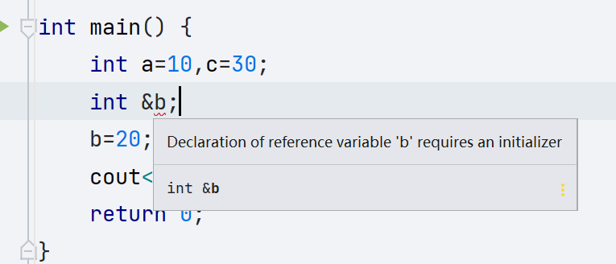
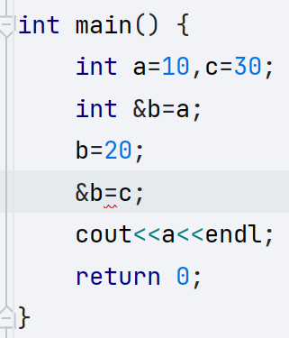
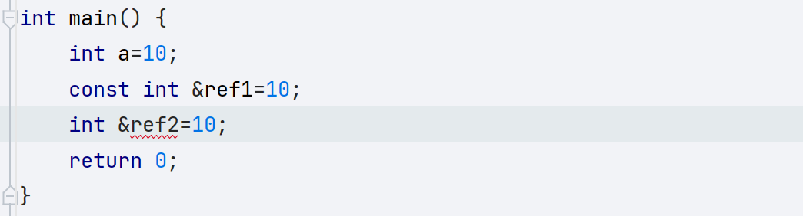
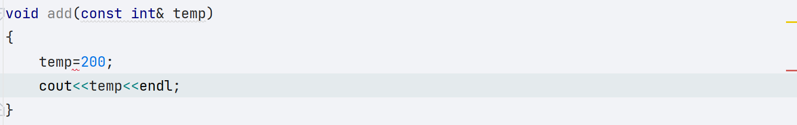

# C++ 基础 (2)

<a id="0">`目录`</a>

- $\textcolor{#e18a3b}{【一】}$**[数组初级](#1)**
- $\textcolor{#e18a3b}{【二】}$**[函数初级](#2)**
- $\textcolor{#e18a3b}{【三】}$**[指针初级](#3)**
- $\textcolor{#e18a3b}{【四】}$**[引用](#4)**

## 一、数组初级

<a id="1"><!--目录--></a>

- $\textcolor{#2a6e3f}{【1】}$ [概念](#1.1)
- $\textcolor{#2a6e3f}{【2】}$ [一维数组](#1.2)
- $\textcolor{#2a6e3f}{【3】}$ [多维数组](#1.3)

### 1、概念<a id="1.1">💚</a>

`数组`：一些具有相同数据类型或相同属性（类）的**数据的集合**，用数据名标识，**用下标或序号区分各个数据**。数组中的数据称为元素。所有的数组都是由**连续的内存位置组成**。最低的地址对应第一个元素，最高的地址对应最后一个元素。

- 【==**内存中连续内存空间**==】

- 【==**数组名也是首地址**==】

---

### 2、一维数组<a id="1.2">💚</a>

在 C++ 中要声明一个数组，需要指定元素的类型和元素的数量

**==注意==**

- 元素数量必须为整数常量，不可为变量，（如需使用变量，使用[动态数组](./basic[3].md#3)）

##### 1、定义

```cpp
int a[10];
int b[10]={0,0};
int c[]={1,1}; // 由编译器决定数组长度
```

##### 2、内存空间

```cpp
int ing[10];
cout<<sizeof(ing)<<endl;
```

##### 3、数组长度

```cpp
int ing[10];
cout<<sizeof(ing)/sizeof(ing[0])<<endl;
```

##### 4、首地址

> 数组名即为数组首地址，不可以改变指针

```cpp
cout<<ing<<endl;
cout<<(long long)ing<<endl;
```

---

### 3、多维数组<a id="1.3">💚</a>

`二维数组举例`

##### 1、定义

```c++
int a[10][10];
int b[10][10]={{0,0},{1,1,1}};
int arr[10][10] = { { 1,2,3 }, {2,3,3} };
int arr[][10] = { { 1,2,3 }, {2,3,3} };
```

##### 2、内存空间

```C++
cout<<a<<"\t"<< sizeof(a)<<endl;
```

---

[<!--返回目录-->](#1)

## 二、函数初级

<a id="2"><!--目录--></a>

- $\textcolor{#2a6e3f}{【1】}$ [函数概念](#2.1)
- $\textcolor{#2a6e3f}{【2】}$ [语法](#2.2)
- $\textcolor{#2a6e3f}{【3】}$ [函数声明](#2.3)
- $\textcolor{#2a6e3f}{【4】}$ [函数定义](#2.4)
- $\textcolor{#2a6e3f}{【5】}$ [函数调用](#2.5)

### 1、函数概念<a id="2.1">💛</a>

- **函数是一组一起执行一个任务的语句**。每个 C++ 程序都至少有一个函数，即主函数 **main()** ，所有简单的程序都可以定义其他额外的函数。
- 您可以把代码划分到不同的函数中。如何划分代码到不同的函数中是由您来决定的，但在逻辑上，划分通常是根据每个函数执行一个特定的任务来进行的。

- 函数**声明**告诉编译器函数的名称、返回类型和参数。函数**定义**提供了函数的实际主体。

- C++ 标准库提供了大量的程序可以调用的内置函数。

---

### 2、语法<a id="2.2">💛</a>

```cpp
return_type function_name( parameter list )
{
   body of the function
}
```

在 C++ 中，函数由一个函数头和一个函数主体组成。下面列出一个函数的所有组成部分：

- **返回类型：**（return_type）一个函数可以返回一个值。**return_type** 是函数返回的值的数据类型。有些函数执行所需的操作而不返回值，在这种情况下，return_type 是关键字 **void**。
- **函数名称：**(function_name)这是函数的实际名称。函数名和参数列表一起构成了函数签名。
- **参数：**(parameter list)参数就像是占位符。当函数被调用时，您向参数传递一个值，这个值被称为实际参数。参数列表包括函数参数的类型、顺序、数量。参数是可选的，也就是说，函数可能不包含参数。
- **函数主体：**(body of the function)函数主体包含一组定义函数执行任务的语句。

---

### 3、函数声明<a id="2.3">💛</a>

```cpp
return_type function_name( parameter list );
```

- 函数声明是提供调用方式
- 函数声明**不包括函数的实体（body），需在函数定义中定义。**
- 当您在一个源文件中定义函数且在另一个文件中调用函数时，**函数声明是必需的**。在这种情况下，您应该在调用函数的文件顶部 / 头文件（后面介绍）声明函数。

---

### 4、函数定义<a id="2.4">💛</a>

```cpp
return_type function_name( parameter list )
{
   body of the function
}
```

- 函数定义需要和函数声明有相同的**函数名，参数类型**

`举例`

```cpp
//函数声明
int compere(int a,int b);
//函数定义
int compere(int a,int b)
{
    return a > b ? a : b;
}
```

---

### 5、函数调用<a id="2.5">💛</a>

> 当程序在运行时，调用函数，将进入此函数函数体中一次执行，当函数执行结束后，在回到此函数调用者的调用的位置，继续往下执行。

- 调用函数时，如需传入参数，需要和函数声明的**参数类型、数量、顺序保持一致，不可更改**。

`举例`

```cpp
cout << compere(2,4) << endl;
```

----

[<!--返回目录-->](#2)

## 三、指针初级

<a id="3"><!--目录--></a>

- $\textcolor{#2a6e3f}{【1】}$ [指针定义](#3.1)
- $\textcolor{#2a6e3f}{【2】}$ [简单使用](#3.2)
- $\textcolor{#2a6e3f}{【3】}$ [二级指针](#3.3)
- $\textcolor{#2a6e3f}{【4】}$ [指针运算](#3.4)
- $\textcolor{#2a6e3f}{【5】}$ [空指针](#3.5)
- $\textcolor{#2a6e3f}{【6】}$ [野指针](#3.6)

### 1、指针定义<a id="3.1">💙</a>

#### 1.1、变量实质

​	变量实际上是存放在内存中，内存是存放数据的空间，内存中就存着变量的真正值。但是需要在这一片空间中找到我们需要的数据，就需要唯一的编号去寻找数据，而内存则是按一个字节接着一个字节的次序进行编址，每个字节都有个编号，我们称之为**内存地址**。

#### 1.2、指针实质

> `简单理解`：在图书馆中，一张小纸条上写着你所需要寻找的书籍位置，此时书籍代表的是你真正需要的**数据（变量）**，纸条中位置的信息代表的就是 **内存地址**，而纸条就是记录这个地址的数据，即为 **指针**。

指针是一个变量，其值为另一个变量的地址。即内存位置的直接地址。

- 指针实质上也是变量
- 指针的长度和其指向的数据无关，**指针的长度和机器字长有关**

---

### 2、简单使用<a id="3.2">💙</a>

#### 2.1、取地址

> **`&`** :取地址符号，获取变量的内存地址

<!--举例-->

```cpp
int a = 20;
cout << &a << endl; // 00000081E27EFC10
```

#### 2.2、指针

```cpp
[ptr]* [ptr_name] = &[type_name];
[指针类型]* [指针名] = &[变量名];
```

- 指针类型需要和变量类型一致

<!--举例-->

```cpp
int a = 20;
int* p = &a;
cout << "a: " << a << endl;
cout << "&a: " << &a << endl;
cout << "p: " << p << endl;
cout << "*p: " << *p << endl;
-----------------------------
a: 20
&a: 0000001B2B6FFCA0
p: 0000001B2B6FFCA0
*p: 20
```

- `p`：值为存放指向值的**内存地址**
- `*p`：值为指向值的**实际变量值**

----

### 3、二级指针<a id="3.3">💙</a>

​	二级指针，是一种指向指针的指针。我们可以通过它实现间接访问数据，和改变一级指针的指向问题。

```cpp
int a = 20;
int* p = &a;
int** pp = &p;
cout << **pp << endl;
cout << sizeof(p) << "\t" << sizeof(pp) << endl;
```

---

### 4、指针运算<a id="3.4">💙</a>

​	指针是一个用数值表示的地址。因此，您可以对指针执行算术运算。可以对指针进行四种算术运算：++、--、+、-。

​	指针 **+1** 即为在内存地址中移向下一个内存单元。

> 假设 **ptr** 是一个指向地址 1000 的整型指针，是一个 32 位的整数，让我们对该指针执行下列的算术运算：
>
> ptr++
>
> 在执行完上述的运算之后，**ptr** 将指向位置 1004，因为 ptr 每增加一次，它都将指向下一个整数位置，即当前位置往后移 4 个字节。这个运算会在不影响内存位置中实际值的情况下，移动指针到下一个内存位置。如果 **ptr** 指向一个地址为 1000 的**字符**，上面的运算会导致指针指向位置 1001，因为下一个字符位置是在 1001。

`总结`：

- 指针的移动长度不是固定的，是根据指针类型变化的，例如：int 移动 4 字节，char移动 1 字节，double移动 8 字节。
- 可以通过指针的移动，学习[指针数组](./basic[3].md#3)

---

### 5、空指针<a id="3.5">💙</a>

​	在变量声明的时候，如果没有确切的地址可以赋值，为指针变量赋一个 NULL 值是一个良好的编程习惯。赋为 NULL 值的指针被称为**空**指针。NULL 指针是一个定义在标准库中的值为零的常量。

```cpp
int* p = nullptr;
cout << p << endl;// 0000000000000000
```

---

### 6、野指针<a id="3.6">💙</a>

指向的内存地址是未知的，操作系统不允许操作此内存。

```cpp
int *p=(int *)0x7fff160addc0;//赋值了任意数，没有意义
```

`注意`

- 野指针本身不会错误
- 操作野指针会发生错误

---

[<!--返回目录-->](#3)

## 四、引用

<a id="4"><!--目录--></a>

- $\textcolor{#2a6e3f}{【1】}$ [定义](#4.1)
- $\textcolor{#2a6e3f}{【2】}$ [注意事项](#4.2)
- $\textcolor{#2a6e3f}{【3】}$ [函数参数](#4.3)
- $\textcolor{#2a6e3f}{【4】}$ [函数返回值](#4.4)
- $\textcolor{#2a6e3f}{【5】}$ [引用的本质](#4.5)
- $\textcolor{#2a6e3f}{【6】}$ [常量引用](#4.6)

### 1、定义<a id="4.1">💜</a>

> **==给变量起别名==**

数据类型 &别名 = 原名

```cpp
int a=10;
int &b=a;
b=20;
cout<<a<<endl;// 20
```

---

### 2、注意事项<a id="4.2">💜</a>

|     引用     |     指针     |
| :----------: | :----------: |
|  必须初始化  | 可以不初始化 |
|   不能为空   |   可以为空   |
| 不能更换目标 | 可以更换目标 |

##### 1、引用必须初始化

```cpp
int a = 10;
int& b; // 不允许，必须初始化
```



##### 2、不可以更改

**<mark>初始化后不可以再更改为其他的引用</mark>**



- 不能定义所谓的空引用，
- 定义引用时必须给与初始化。
- 引用没有二级引用，引用不分等级，没有引用的引用。

---

### 3、函数参数<a id="4.3">💜</a>

```cpp
void Swap(int &a,int &b)
{
    int temp=a;
    a=b;
    b=temp;
}

int main() {
    int a=10,c=30;
    Swap(a,c);
    cout<<a<<" "<<c<<endl;
    return 0;
}
```

- 引用时，**没有空引用所以不需要判断，比指针安全，**在调动函数时必须对行参的引用初始化。

---

### 4、函数返回值<a id="4.4">💜</a>

##### 1、不可以返回局部变量的引用

```cpp
int& swap() {
	int a = 10;
	return a;
	// 不允许，不可返回局部变量的引用，局部变量会在函数结束后释放。
}
```

##### 2、引用可以作为左值

```cpp
int &Swap() {
    static int a = 10;
    return a;
}

int main(int argc, char const *argv[]) {
    int a = 10, c = 30;
    int &x = Swap();
    cout << x << endl; //  10
    Swap() = 100;
    cout << x << endl; // 100
    return 0;
}
```

---

### 5、引用的本质<a id="4.5">💜</a>

> **int &ref=a; ------->int * const ref=&a;(指针常量)**

指向的值可以改，指针指向不可以改。

---

### 6、常量引用<a id="4.6">💜</a>





`值传递会占用多余内存，常量引用防止误操作`

---

[<!--返回目录-->](#4)

[<!--返回总目录-->](#0)

**[README]()**